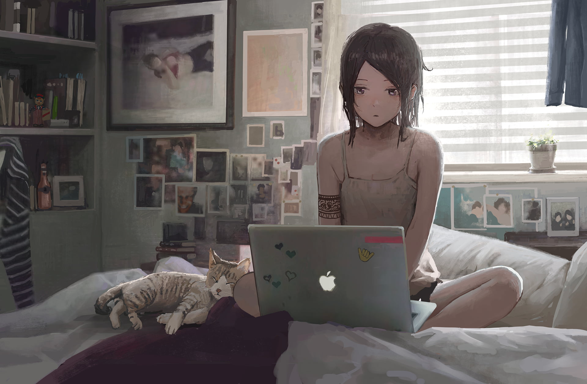

# BMSTU IU5 Laboratory Works.

## Frontend:
  

<!-- 

 -->

- [X] [05-lab-05-Ahmedkashima](https://github.com/kashima1234/WEBF_IU5_BMSTU/tree/frontend/SPA)
- [X] [05-lab-06-Ahmedkashima](https://github.com/kashima1234/WEBF_IU5_BMSTU/tree/frontend/Redux)
- [X] [05-lab-07-Ahmedkashima](https://github.com/kashima1234/WEBF_IU5_BMSTU/tree/frontend/ser-interface)
- [X] [05-lab-08-Ahmedkashima](https://github.com/kashima1234/WEBF_IU5_BMSTU/tree/Real-time)
