**Лабораторная 6**
Цель работы: Внедрение адаптивности и развертывание приложения
Порядок показа: Открыть GitHub Pages с mock на телефоне, сохранить PWA. Открыть PWA, применить фильтрацию услуг, перейти на главную и вернуться, чтобы показать старое значение фильтра. Перейти в адаптивный режим браузера, поменять ширину. Объяснить настройки для размера карточек, количества колонок и тд - показать конкретные значения размера и количества колонок, карточек. На компьютере показать подключение Tauri к бэкенду по IP локальной сети (не localhost), сравнить IP сервера из консоли и в коде приложения. Отредактировать услуги в БД и продемонстрировать изменение в Tauri.
Контрольные вопросы: flux, схема redux (store, reducer, dispatch, action), PWA, Tauri, Pages
Deployment диаграмма все узлы и компоненты системы: фронтенда, web-сервера со статикой, веб-сервиса, базы данных и других хранилищ и тд. Узлы соединить протоколами, компоненты фронтенда и бэкенда поместить в узлах, указать API между ними.
Задание: Внедрить менеджер состояний для хранения значений фильтров, добавление адаптивности и PWA, создание Tauri и развертывание в Pages
Добавление менеджера состояний Redux Toolkit для хранения фильтра услуг. Необходимо развернуть фронтенд на GitHub Pages и добавить возможность работы в режиме PWA. Добавить адаптивность для трех страниц приложения.

# display Order

**Deployment in github** 

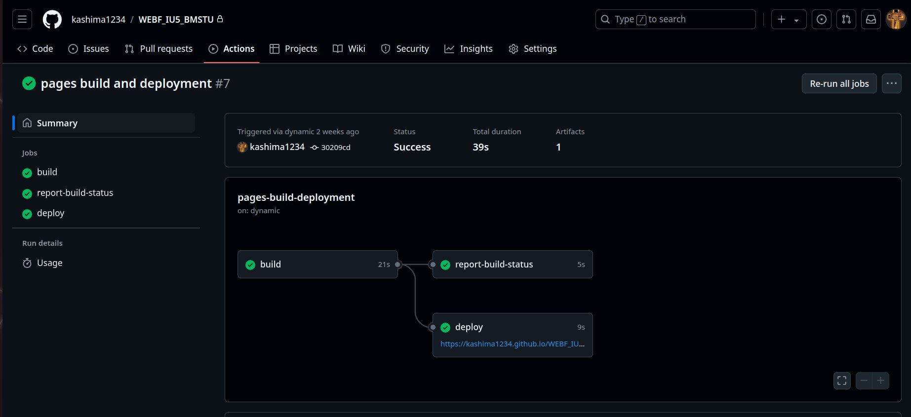

**Pages with installation for PWA**

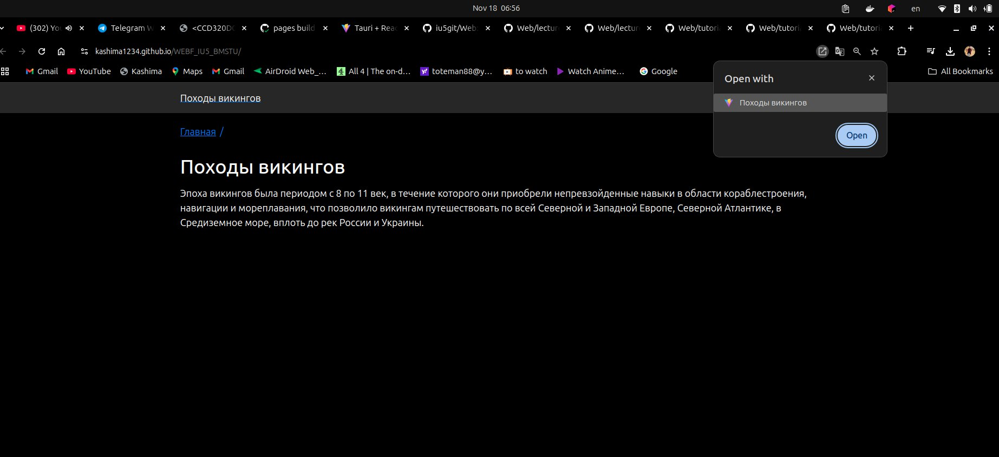

**Uncle PWA**

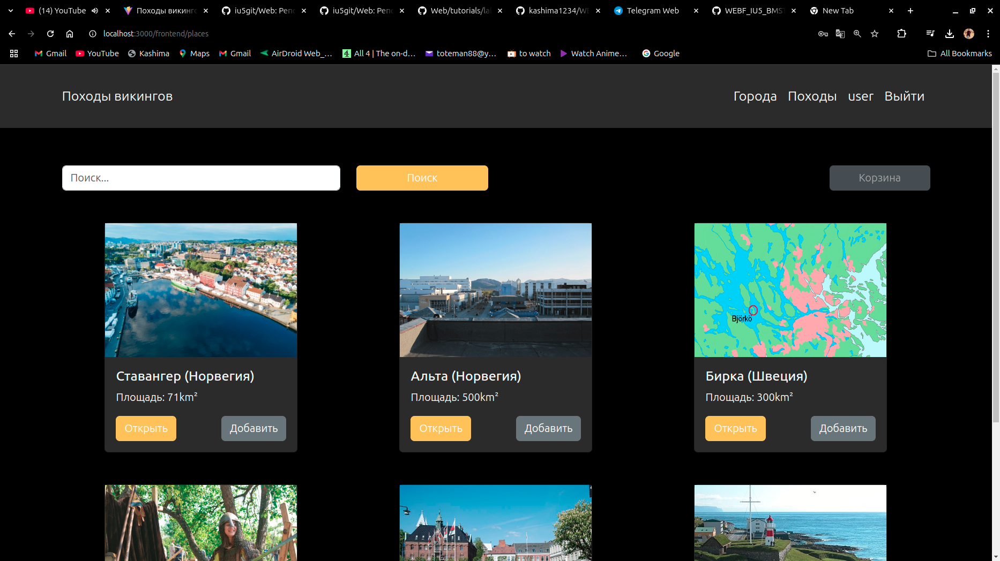
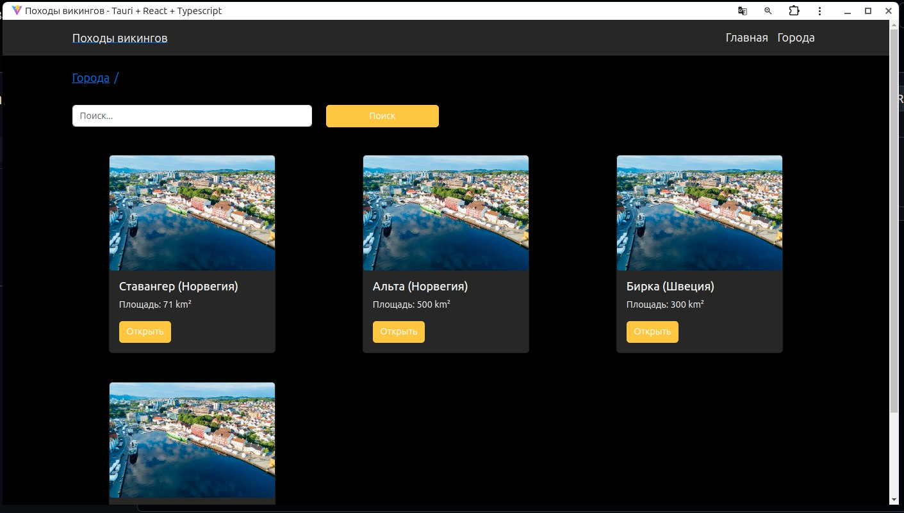
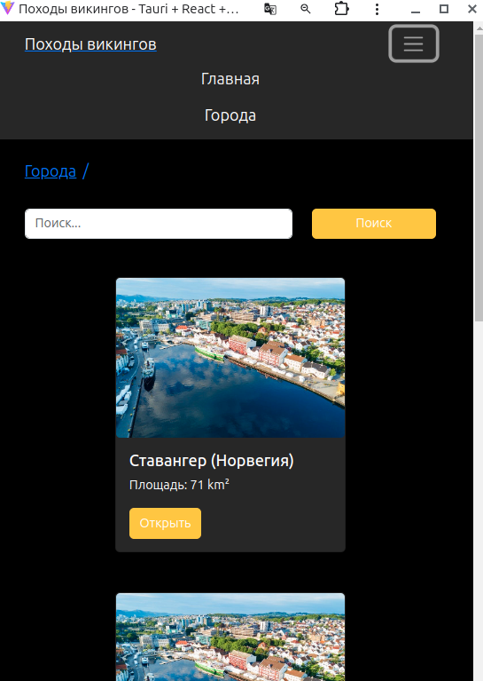

**From the phone wassup nigga)** 

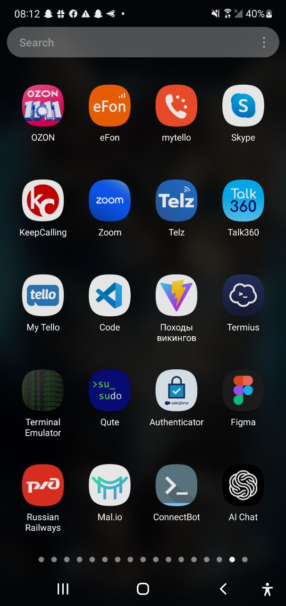
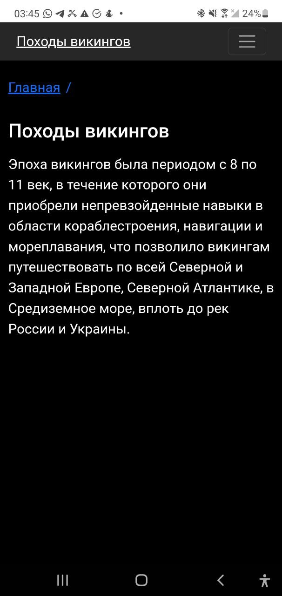
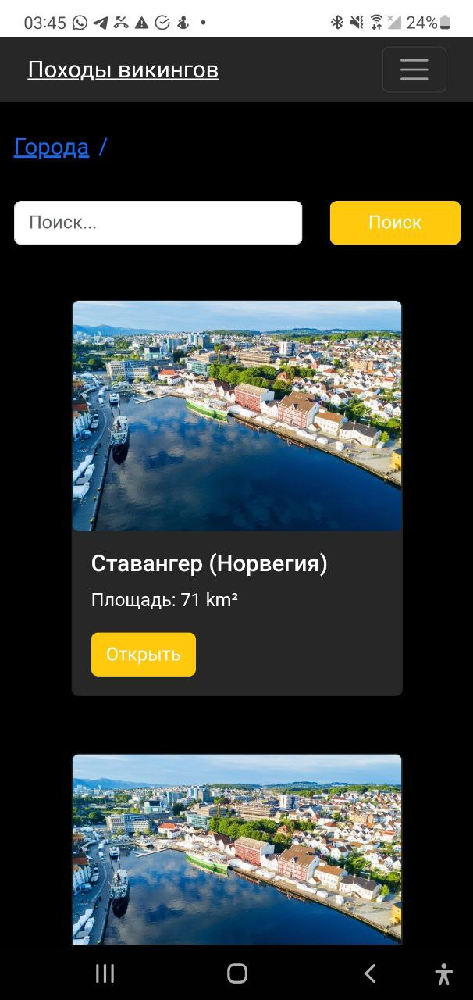

# http://localhost:3000 

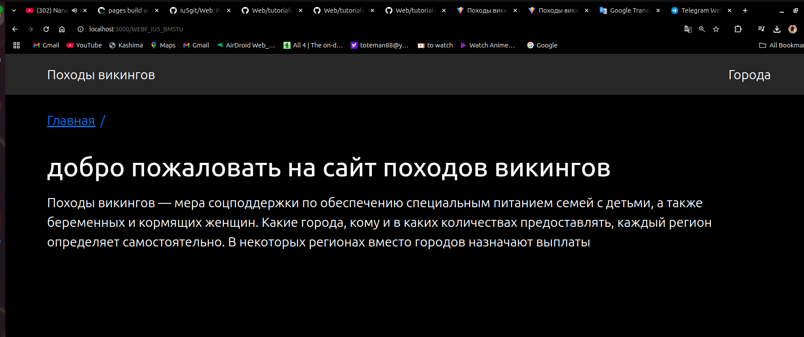
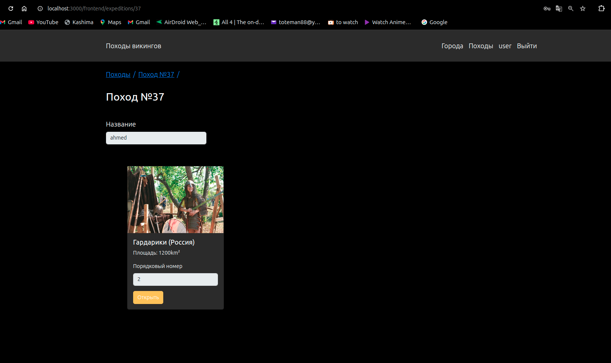

# Tauri uncle
-npm run tauri dev
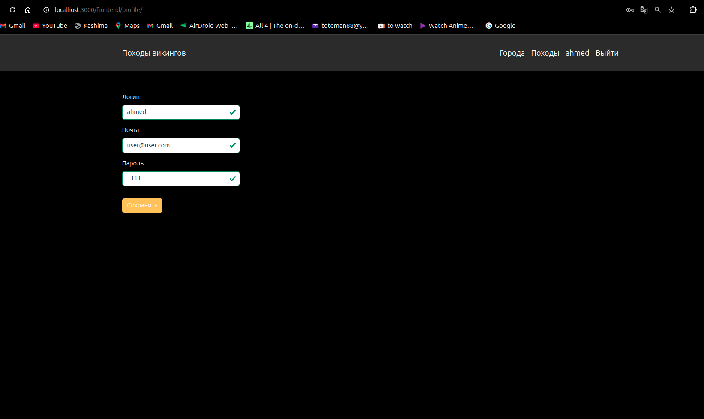
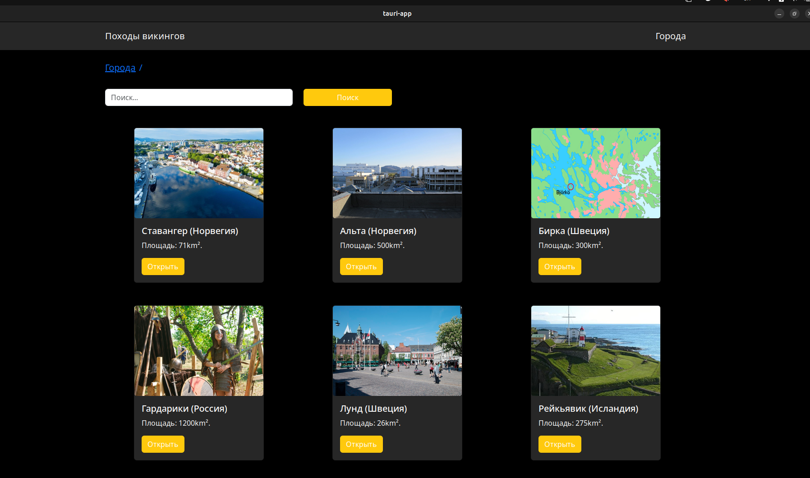
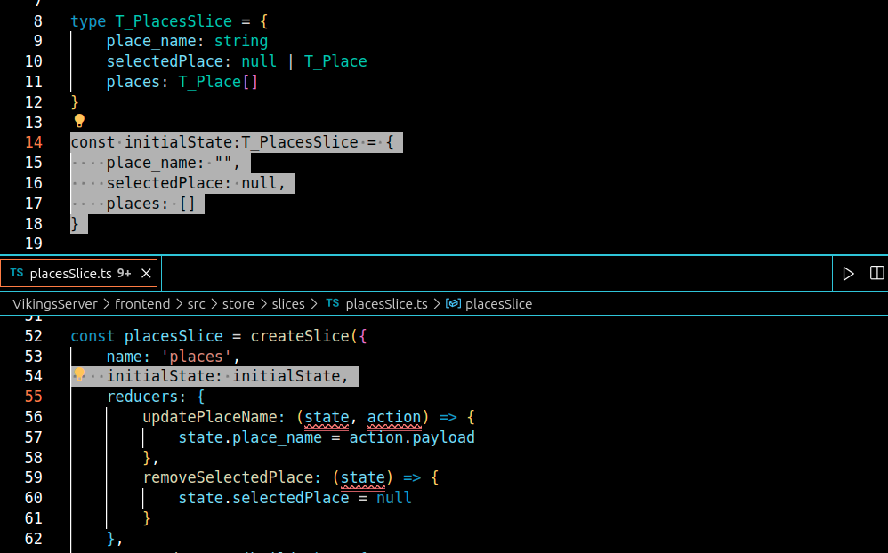

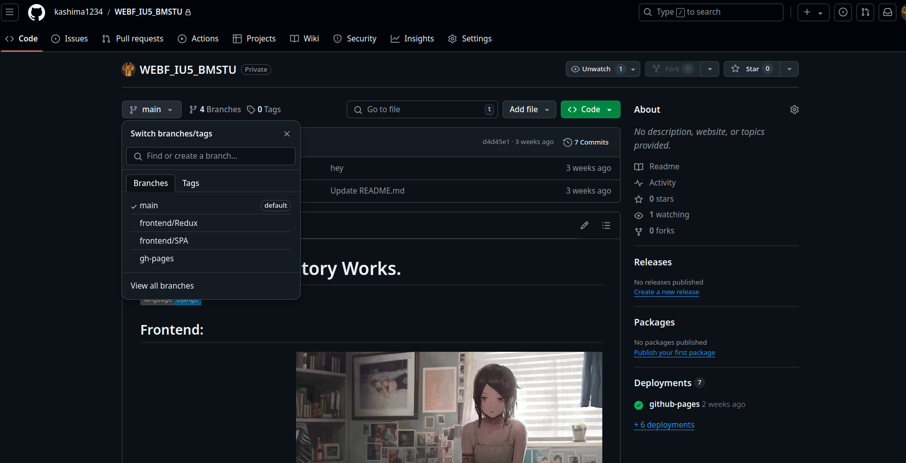

## ;)