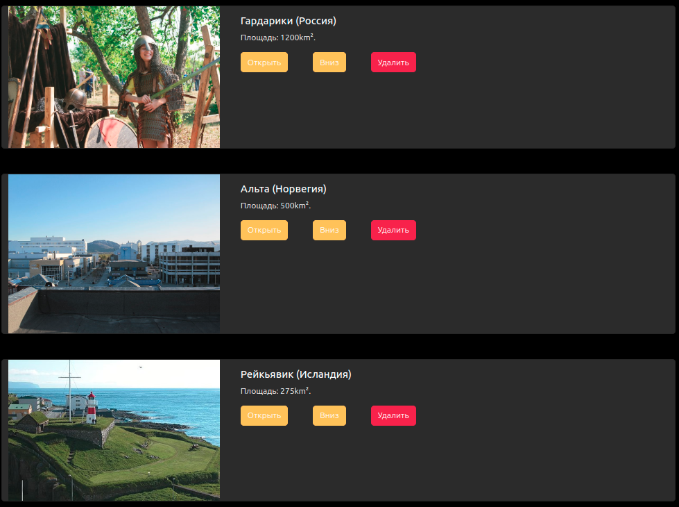
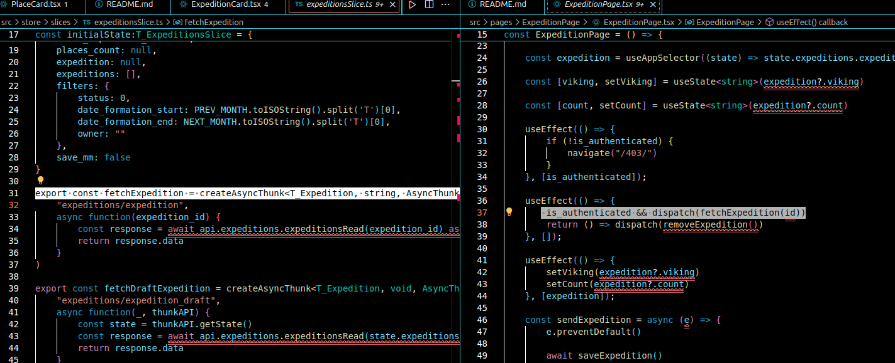
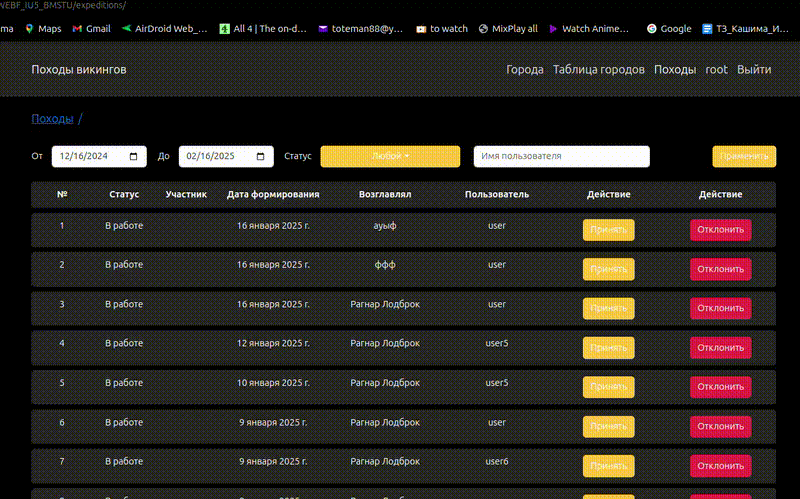
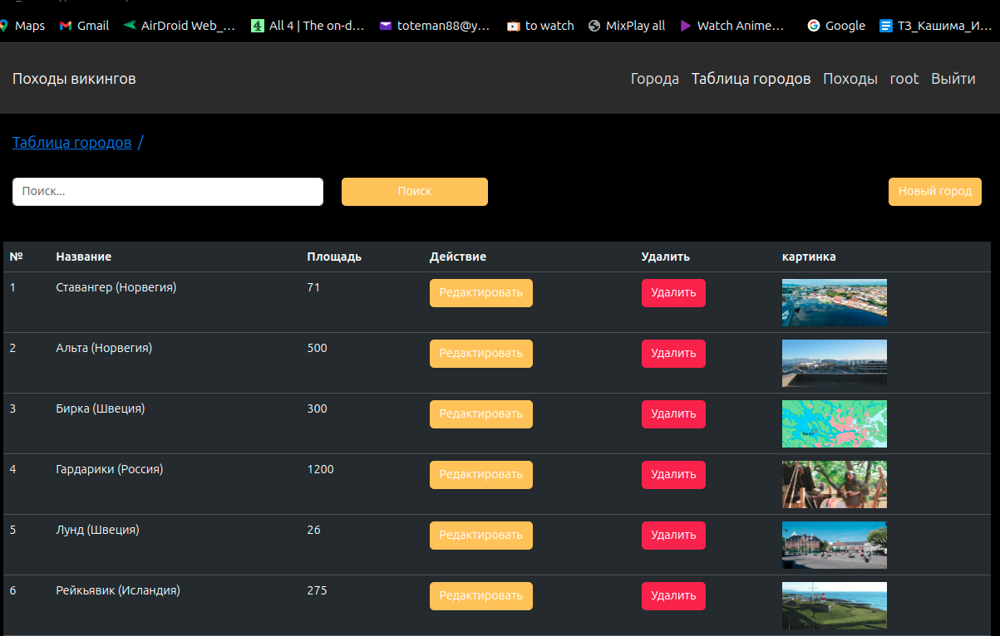
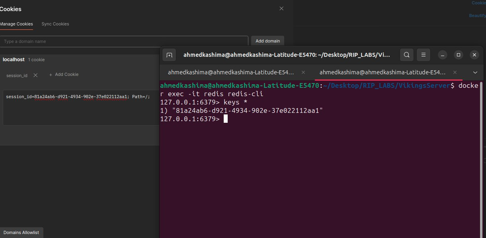
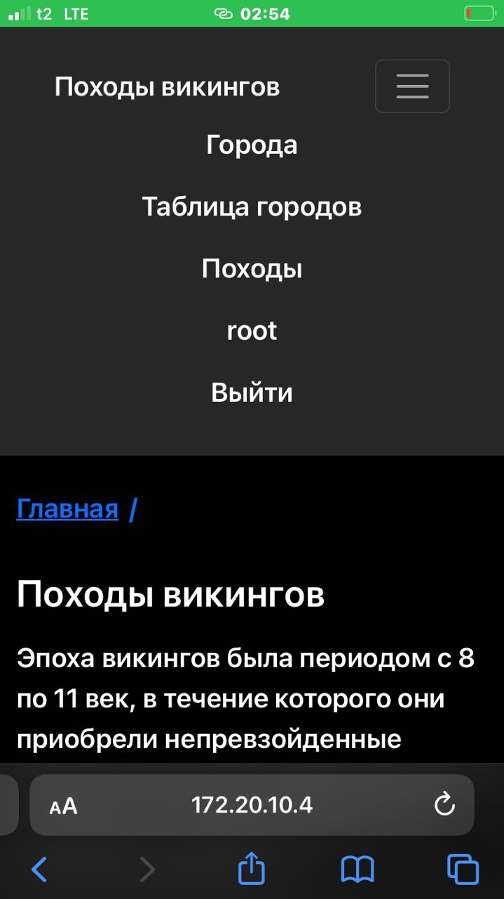
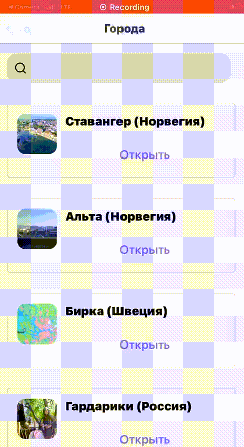
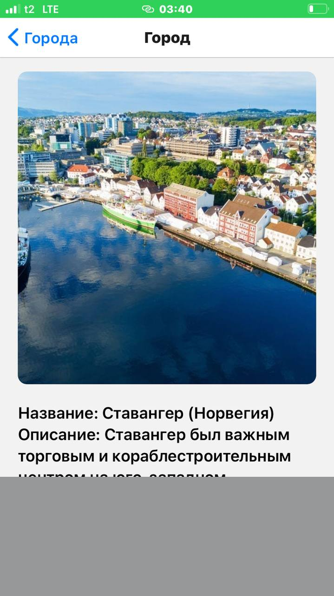
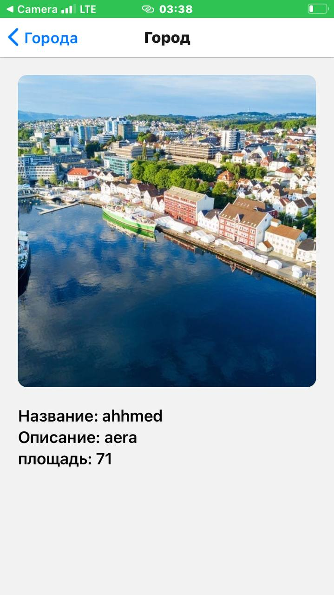

- [X] [НЕ НАДО САМОМУ ДЕЛАТЬ ПОРЯДОК, ТЫ ПРОСТО НАЖИМАЕШЬ КНОПКУ ВНИЗ и ОН САМ СЛЕДУЮЩУЮ С ПРЕДЫДУЩЕЙ.
ДОЛЖНА БЫТЬ СОРТИРОВКА "PUT м-м. Поменять порядок (down) для верхней услуги в заявке: было 1-2-3, стало 2-1-3](https://github.com/kashima1234/WEBF_IU5_BMSTU/blob/Real-time/VikingsServer/src/components/PlaceCard/PlaceCard.tsx)

-----

- [X] [ПОЧЕМУ НЕ РАБОТАЕТ ФОРМИРОВАНИЕ? ЗАЯВКА Должать стать сформированной и перейти в список заявок](https://github.com/kashima1234/WEBF_IU5_BMSTU/blob/Real-time/VikingsServer/src/pages/ExpeditionPage/ExpeditionPage.tsx)

--------

- [X] [прислать в коде использование thunk, где ты их используешь?](
https://github.com/kashima1234/WEBF_IU5_BMSTU/blob/Real-time/VikingsServer/src/pages/ExpeditionPage/ExpeditionPage.tsx)
- [X] [also](https://github.com/kashima1234/WEBF_IU5_BMSTU/blob/Real-time/VikingsServer/src/store/slices/expeditionsSlice.ts)

__--------__

- не работает завершении и Отклонение заявки

--------

 список заявок: убрать дату созданеия, и дату завершения, но доавить поле Кто возглавлял

дату созданеия, и дату завершения has been deleted and been add возглавлял as well as 

-------

- [X] [таблице услуг нужны маленькие картинки. Кнопка удалить должна быть только в общей таблице](https://github.com/kashima1234/WEBF_IU5_BMSTU/blob/Real-time/VikingsServer/src/components/PlacesTable/PlacesTable.tsx)

-------

показать содержимое редис в командной строке компьютера, а не в docker

по ip адресу телефона открывать в браузере приложение? 192.168. и тд на телефоне

its 172.20.10...

## mobile app video Rolik
 

screen

---

